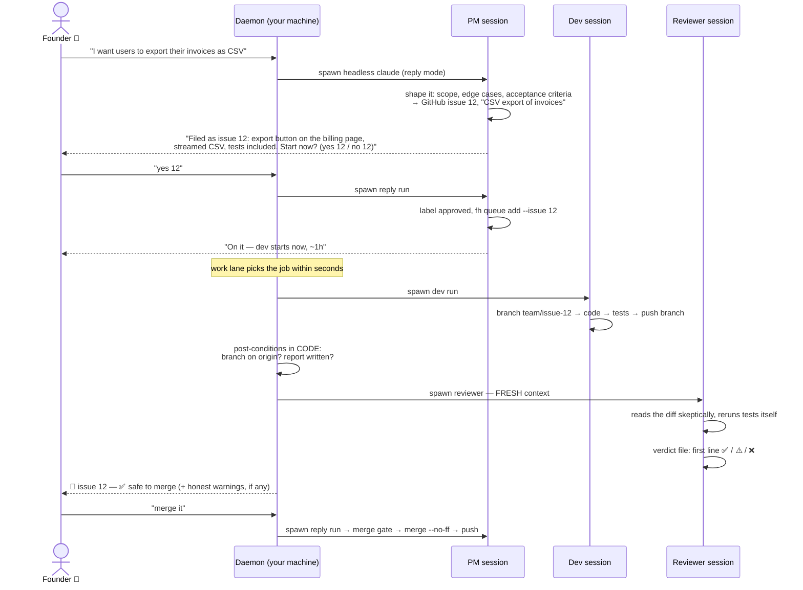
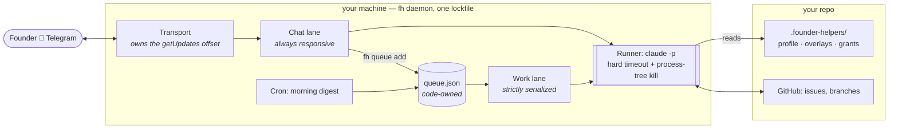
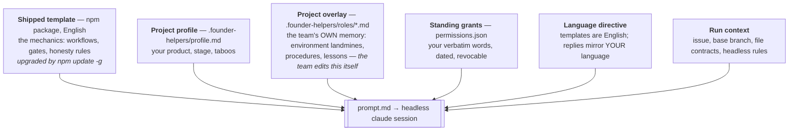
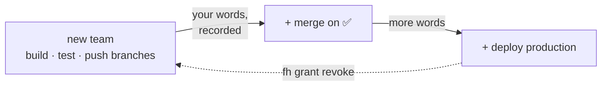

# founder-helpers — the idea, for engineers

**You're the CEO. Your team is AI.** A PM, a developer and a code reviewer run
as headless [Claude Code](https://claude.com/claude-code) sessions on *your*
machine, work through *your* GitHub issues in *your* repo, and report to you
in Telegram — in whatever language you write. You make decisions from your
phone; they do the work.

No cloud service, no platform, no YAML orchestra. One npm package, one daemon,
one markdown file per role. Everything the team is and knows lives in git.

---

## One conversation, end to end

What actually happens between "I want this" typed on your phone and merged
code (chat shown in English — the team mirrors whatever language you write):



Two ideas hide in this picture:

1. **The dev and the reviewer never share a context.** The reviewer doesn't
   know how hard the dev tried — it sees an issue, a diff and a claim, and it
   reruns the tests itself. Fresh eyes are a feature of the architecture, not
   of discipline.
2. **Completion facts come from code, not from the model's self-report.**
   After each run the daemon itself checks: is the branch actually on origin?
   does the report file exist? does the verdict parse? Whatever fails becomes
   an honest warning line in your chat.

---

## The machine

One daemon per project. Two lanes, so a 90-minute dev run never makes your
chat go silent:



Rules the daemon lives by (each one paid for by a production incident in the
predecessor system):

| Rule | Why |
|---|---|
| The transport owns the message offset; a model can never write it | A single stray `\q` in a model-written state file once crash-looped the old daemon for 19 hours |
| A rejected message handler ⇒ redelivery | A founder message is never silently lost; a 3-strike ladder ends in an honest apology, not a black hole |
| A queue job is removed only after its chain completes | A crash mid-job means a rerun, never a vanished task |
| Runs are killed by process tree, not by pid | An orphaned dev-server once ate 60% CPU for six hours |
| Logs rotate | daemon.log had reached 79 MB |

---

## Where the intelligence lives

Every run's prompt is assembled fresh, in layers. The split is the point:



**Brains vs memory.** `npm update -g` upgrades every team's mechanics — and
touches nothing the team has learned about *your* project, because learning
lands in overlays, in your repo, in git history. When you correct the team,
the PM's first job is to edit the overlay *in the same run* and commit it.
"My instructions say otherwise" is explicitly not an argument: the
instructions get rewritten.

**Custom roles are just files.** Drop `.founder-helpers/roles/marketer.md`,
add one config entry, and it's a team member — schedulable in the digest
pipeline, runnable on demand. No plugin API.

---

## The trust model: modest by default, explicit by grant

A fresh team can build, test and push work branches — and can NOT touch your
integration branch. Headless runs get a generated allowlist; a denied command
fails *soft*: the model receives the denial and must report the exact
unblock recipe instead of faking success.

When you decide the team has earned autonomy, you say so once — and it's
**recorded, verbatim**:

```jsonc
// .founder-helpers/permissions.json — committed, diffable, revocable
{
  "scope": "git.merge_integration_branch",
  "date": "2026-08-04T15:00:00Z",
  "quote": "merge it yourself when the review is green — stop asking every time",
  "conditions": "tests green AND verdict ✅ only",
  "revoked": null
}
```

The ledger is the team's authority audit trail: every power it has traces to
your actual words on a date, with an `fh grant revoke <id>` one-liner to take
it back. Two things are never grantable, by design: speaking to the outside
world as you, and spending money.



---

## Why it feels different

- **Honesty is enforced, not requested.** "An invented success is worse than
  an honest failure" is in every template — and the post-conditions,
  fresh-context review and grant gates make the honest path the only one that
  survives scrutiny.
- **Founder-minutes are the scarce resource.** One digest a day, numbered
  decisions you answer with two characters, work that starts the second you
  say yes.
- **It's all just git.** Roles, knowledge, permissions, audit trail —
  markdown and JSON in your repo. Reading the whole system takes an evening;
  `src/` has three runtime dependencies.

## Born in production

This tool is the second system. The first was a pile of PowerShell scripts
running a real product's AI team for two weeks — merging code nightly,
surviving session limits, a 19-hour daemon outage and one very hungry
orphaned process. Every rule above is a scar from that fortnight.

And it's dogfooded: founder-helpers' own repo runs a founder-helpers team.
[Issue #8](https://github.com/dmatvienco/founder-helpers/issues/8) —
`fh status --json` — was implemented by a headless dev run, reviewed ✅ by a
fresh-context reviewer that reran the tests itself, and merged through the
gate. An hour later that flag was used in production during a migration.

---

*Start here: [getting-started.md](getting-started.md) · deeper internals:
[architecture.md](architecture.md) · the permission model:
[permissions.md](permissions.md)*
